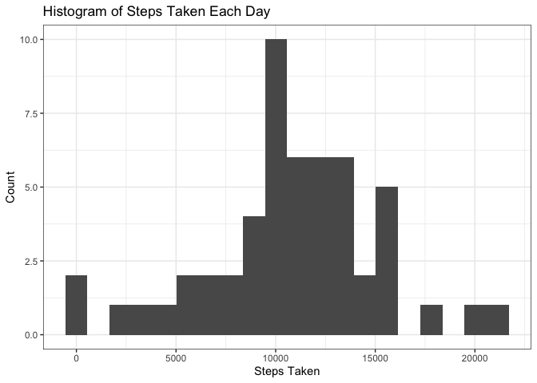
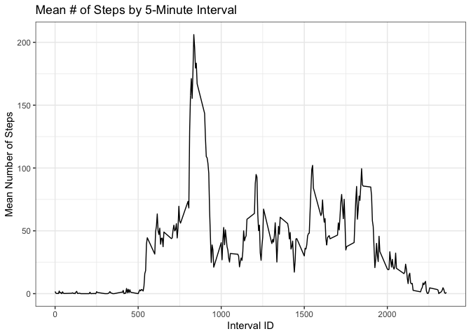
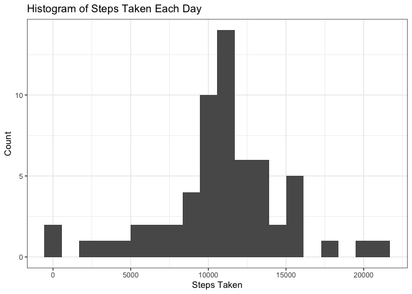

## Loading and preprocessing the data

The first step is to load relevant libraries:


```r
library(knitr)
library(tidyverse)
```

```
## ── Attaching packages ─────────────────────────────────────── tidyverse 1.3.1 ──
```

```
## ✓ ggplot2 3.3.3     ✓ purrr   0.3.4
## ✓ tibble  3.1.1     ✓ dplyr   1.0.7
## ✓ tidyr   1.1.3     ✓ stringr 1.4.0
## ✓ readr   1.4.0     ✓ forcats 0.5.1
```

```
## ── Conflicts ────────────────────────────────────────── tidyverse_conflicts() ──
## x dplyr::filter() masks stats::filter()
## x dplyr::lag()    masks stats::lag()
```

```r
library(lubridate)
```

```
## 
## Attaching package: 'lubridate'
```

```
## The following objects are masked from 'package:base':
## 
##     date, intersect, setdiff, union
```

Next, unzip and load the activity monitoring data set (which should be in the 
working directory), and convert it to a tibble:


```r
dat <- tibble(read.csv(unz("activity.zip", "activity.csv")))
```

This data frame has 3 columns:
* steps         The number of steps taken during the 5 minute interval in each row.
* date          The date of the observation (ranges from 10/1/2012 to 11/30/2012).
* interval      The 5 minute interval over which the number of steps is recorded.

The interval variable is an integer coded in the format HM, where H is the hour 
of the day from 0-23, and M is the minute from 0-55 in multiples of 5 minutes.
As an example, an interval of 325 indicates the 5-minute window from 3:25 AM 
to 3:30 AM, 2355 is the interval from 11:55 PM to 12:00 AM the following day.

To put this interval into a more usable format, we will convert it into the actual
time of day (added to the data frame as the variable 'time') and a 'time.stamp'
variable that contains the date & time of the start of the interval:


```r
dat <- dat %>% mutate(hours = interval %/% 100, minutes = interval %% 100)

dat <- dat %>% mutate(time = paste0(as.character(hours), ":", ifelse(minutes<10, paste0("0",as.character(minutes)), as.character(minutes))))

dat <- dat %>% mutate(time.stamp = as.POSIXlt(paste(date, time, sep=" ")))

dat <- dat %>% select(-c(hours, minutes))   # this gets rid of the redundant hours and minutes columns.
```


## Histogram of the total number of steps taken each day

To determine the number of steps taken on each day, group the data frame by
date and sum up the number of steps in each group (i.e., for each day). Then
histogram the total steps.

But first, notice that there are some days with quite a few missing values 
(indicated by steps = NA). It turns out that there ~13% of the step values are NAs:

```r
percent_missing <- mean(is.na(dat$steps)) * 100
```

To see if these NA values are clustered around certain days, we can arrange the 
dates by the percentage of intervals that have NA steps:

```r
percent_missing_by_day <- dat %>% group_by(date) %>% 
                          summarize(percent.NA = mean(is.na(steps))) %>%
                          arrange(desc(percent.NA))
print(percent_missing_by_day)
```

```
## # A tibble: 61 x 2
##    date       percent.NA
##    <chr>           <dbl>
##  1 2012-10-01          1
##  2 2012-10-08          1
##  3 2012-11-01          1
##  4 2012-11-04          1
##  5 2012-11-09          1
##  6 2012-11-10          1
##  7 2012-11-14          1
##  8 2012-11-30          1
##  9 2012-10-02          0
## 10 2012-10-03          0
## # … with 51 more rows
```
It appears that there are 8 days where ALL of the step values are NA; all other
days have no NA values. We will exclude these days from the histogram of total
steps, initially.

Next, let's sum up the steps in each day using group_by, and grouping by date. 
We will then plot a histogram of the resulting total step counts.


```r
# note that we are explicitly not removing NA values in the function call to sum, but will use filter to remove days that contain NA values.

total_steps <- dat %>% group_by(date) %>% 
                       summarize(total.steps = sum(steps, na.rm = FALSE)) %>%   
                       filter(!is.na(total.steps))
ggplot(total_steps) + geom_histogram(mapping = aes(x = total.steps), bins=20) + theme_bw() +
    labs(x = "Steps Taken", y = "Count", title = "Histogram of Steps Taken Each Day")
```

<!-- -->

In this plot, we see that there are two days with steps in the 0 bin. This could be the
result of a data collection error (step counter not working, but not providing
an obvious error like an NA value) or the user may not have been wearing the 
device for much of the day. Something to watch out for in further analysis.

## What is mean total number of steps taken per day?

The mean and median of the number of steps taken each day can be computed from
the summarized data frame total_steps (which is grouped by date):

```r
mean_number_of_steps <- mean(total_steps$total.steps)
median_number_of_steps <- median(total_steps$total.steps)
```

## What is the average daily activity pattern?

To determine how the user's activity varies over time, first group the data by
interval, then take the mean within each group. This will give the mean number
of steps taken in the 5 minutes interval from 0:00-0:05, 0:05-0:10, 0:10-0:15, etc.
averaged over all of the observation dates.

```r
activity_by_interval <- dat %>% group_by(interval) %>% summarize(mean.steps.in.interval = mean(steps, na.rm=TRUE))
ggplot(activity_by_interval, mapping = aes(x = interval, y = mean.steps.in.interval)) + 
    geom_line() +
    theme_bw() +
    labs(x = "Interval ID", y = "Mean Number of Steps", title = "Mean # of Steps by 5-Minute Interval")
```

<!-- -->
Note that the Interval ID is not simply proportional to time of day, due to the fact that it jumps from ..55 to ..100 every hour.

The maximum mean step count and the interval in which it occurs can be found as follows:

```r
max_mean_steps <- max(activity_by_interval$mean.steps.in.interval)
interval_with_max_steps <- with(activity_by_interval, interval[which.max(mean.steps.in.interval)])
```


## Imputing missing values

Fill in the missing days with the mean 5-minute step profile (see the section
above), rounded to the nearest step. Rounding will avoid any strange non-integer
(or non half-integer) behavior with calculating the median.


```r
# create a new column with the mean steps in the row's interval (this will be the same for each date)
dat_imputed <- dat %>% right_join(activity_by_interval, by="interval") %>%     
               mutate(steps = ifelse(is.na(steps), round(mean.steps.in.interval), steps)) %>%
               select(-mean.steps.in.interval)
```


Now repeat the histogram of total steps each day, as above (but don't filter 
out the NA rows; any remaining NAs should be caught as an error):


```r
total_steps_imputed <- dat_imputed %>% group_by(date) %>% 
                               summarize(total.steps = sum(steps, na.rm = FALSE))

ggplot(total_steps_imputed) + geom_histogram(mapping = aes(x = total.steps), bins=20) + theme_bw() +
    labs(x = "Steps Taken", y = "Count", title = "Histogram of Steps Taken Each Day")
```

<!-- -->
Again, we can compute the mean and median of the total step counts:

```r
mean_number_of_steps_imputed <- mean(total_steps_imputed$total.steps)
median_number_of_steps_imputed <- median(total_steps_imputed$total.steps)

# Create a table for comparing imputed/unimputed mean & medians
tibble(Statistic=c("Mean","Median"), 
       "Original (Unimputed)"=c(mean_number_of_steps, median_number_of_steps),
       Imputed = c(mean_number_of_steps_imputed, median_number_of_steps_imputed))
```

```
## # A tibble: 2 x 3
##   Statistic `Original (Unimputed)` Imputed
##   <chr>                      <dbl>   <dbl>
## 1 Mean                      10766.  10766.
## 2 Median                    10765   10762
```

In this case, imputing the step data based on the mean values by interval resulted
in a ~0.005% change in the mean steps per day, and a ~0.03% change in the median
value. It is not surprising that the change to the mean is much smaller than the 
change to the median, since adding full days with the mean number of steps should
not be expected to change the mean at all; the only small change comes from the 
fact that we rounded the mean steps in each interval before imputing.

## Are there differences in activity patterns between weekdays and weekends?

Determine whether each date is a weekend or weekday, and add a factor variable
based on this classification:

```r
dat <- dat %>% mutate(day = weekdays(time.stamp))
weekdays_table <- tibble(day=unique(dat$day)) %>% 
                  mutate(type=factor(ifelse(day=="Saturday" | day=="Sunday", "Weekend", "Weekday")))
dat <- dat %>% right_join(weekdays_table, by="day")
```

(The above code works by creating a lookup table that categorizes each named day
as a weekday or weekend, then merges this table to dat based on the day of the
week for each observation).

Again, compute the mean steps in each interval, but this time group not only
by interval but also by the type of day (weekday vs. weekend)


```r
activity_by_interval <- dat %>% group_by(interval, type) %>% summarize(mean.steps.in.interval = mean(steps, na.rm=TRUE))
```

```
## `summarise()` has grouped output by 'interval'. You can override using the `.groups` argument.
```

```r
ggplot(activity_by_interval, aes(x=interval, y=mean.steps.in.interval)) + 
    geom_line() +
    facet_grid(type ~ .) +
    theme_bw() +
    labs(x = "Interval ID", y = "Mean Number of Steps", title = "Mean # of Steps by 5-Minute Interval")
```

<!-- -->

We can also look at the difference in mean step count for weekend and weekdays:


```r
dat %>% group_by(date) %>% summarize(type.of.day=first(type), total.steps = sum(steps, na.rm=TRUE)) %>%
        group_by(type.of.day) %>% summarize(mean.total.steps = mean(total.steps))
```

```
## # A tibble: 2 x 2
##   type.of.day mean.total.steps
##   <fct>                  <dbl>
## 1 Weekday                8820.
## 2 Weekend               10856.
```
